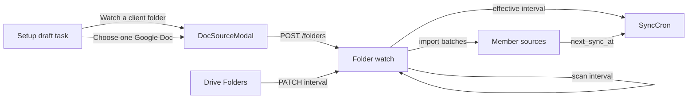

# Agency automation setup — design

Date: 2026-08-23  
Status: draft for implementation  
Related: [plans/260823-agency-automation-setup/plan.md](../../plans/260823-agency-automation-setup/plan.md), [plans/260822-0140-agency-folder-automation-workspace/plan.md](../../plans/260822-0140-agency-folder-automation-workspace/plan.md)

## Target user

Primary user is an **agency operator**, not a one-off publisher linking a single Doc.

Typical job: connect Google once, watch a **client Drive folder**, land every Doc as a WordPress draft (or publish), keep those posts fresh on a **per-client cadence**, then hand the client a Sources / Drive Folders workspace.

Success is “this client folder is on rails,” not “I created one synced draft.”

## Current product (verified)

Phase 1 of the agency folder workspace shipped in 1.1.5:

- Drive Folders screen can create and edit watches (schedule, post status, presets, subfolders, excludes).
- Setup opens the shared Doc source modal. Folder intent exists but is hidden behind a toggle. Activation UX tracks **one** Doc source.
- A watch interval only schedules **folder scans** (`docsync_wp_scan_folder`). Imported Docs re-sync on the **site** `SyncCron` interval (`last_synced_at`, 20 per tick, no continuation).

Agency pain:

1. Setup still reads like a single-Doc onboarding checklist.
2. “Hourly folder” does not mean hourly content refresh.
3. 50 client Docs stall behind a 20-source cron ceiling.

## Product lock

- **All free.** No Pro gate.
- **Folder-first Setup for agencies.** After site + Google are ready, the primary next action is **Watch a client folder**. **Choose one Google Doc** stays as a secondary path.
- **One schedule knob, two effects.** Watch interval governs discovery **and** member-Doc re-sync.
- **Activation.** Setup completes when the current user has at least one healthy source (`synced`/`skipped` + `lastSyncedAt`) **or** a folder watch that has imported at least one Doc and is `watching`/`importing`. Folder creation must show import progress on Setup, not only “View Sources.”
- **Post type chosen before the modal.** Setup uses a compact target-type select (from `workspace.creatablePostTypes`) instead of silently taking `[0]`. Watch `postType` stays creation-fixed.
- **Weekly** is a first-class interval everywhere site/watch/source schedules are validated. No 15-minute interval.
- **Per-source override** exists for the one Doc that must not follow the folder/site cadence (`off|hourly|twicedaily|daily|weekly` or inherit).
- **Out of this train:** CPT watch storage, raised 50/500 caps, Drive Changes API, removed-Doc policy, category/author mapping, ownership transfer, email digests. Those remain later phases of the Aug 22 agency plan.

## Surfaces

## UX copy rules

- Agency nouns: **client folder**, **member Docs**, **re-sync schedule**. Avoid “Posts list → Add Sync Doc.”
- Drive Folders detail must label **Next scan** and **Member re-sync** separately until operators trust they are the same knob.
- Setup folder activation copy: “Creating drafts from this folder” while importing; “Folder automation is active” after the first imported Doc is healthy or the watch reaches `watching` with `importedCount >= 1`.
- Destructive actions stay on Radix confirms. Setup remains `manage_options`.

## Error handling

- Folder create failure stays in the modal (existing).
- Import failures stay on the watch (`failed[]`) with Retry; Setup links to Drive Folders detail, not a second failed-file UI.
- `off` effective interval clears `next_sync_at`; manual sync still works and does not re-enter the schedule.
- Continuation events hard-stop after 20 chained ticks per recurring window.

## Testing

- PHP: `scripts/verify-schedule-resolver.php` (composer `test:schedule-resolver`) for precedence, due arithmetic, `off`, weekly.
- PHP: extend `scripts/verify-folder-watch-update.php` for member `next_sync_at` recompute on interval change.
- Existing fixture suites unchanged.
- Frontend: `pnpm typecheck`, `pnpm lint`, `pnpm build`.
- Manual: Setup folder-first path, hourly watch vs daily site, metabox override `off`.
