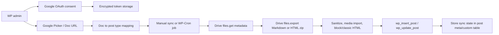

# Research Report: Google Docs to WordPress Sync Plugin

Conducted: 2026-05-17 16:34:11 +07

## Executive Summary

Build the first version as a one-way Google Docs -> WordPress sync. Let an admin connect a Google account with OAuth 2.0, select one or more Google Docs, map each Doc to a WordPress `post` or chosen custom post type, then sync manually or on a schedule.

The lowest-friction OAuth design is per-site "bring your own Google OAuth client" credentials for MVP. A distributed SaaS-style client owned by you creates harder redirect URI, verification, data policy, and support obligations. For scopes, prefer `https://www.googleapis.com/auth/drive.file` plus Google Picker because it limits access to files the user explicitly selects. Broad scopes such as `drive.readonly`, `drive`, `documents.readonly`, and `documents` create more consent friction and can trigger sensitive/restricted-scope review.

For content conversion, Drive API export is the pragmatic path. Export Google Docs as `text/markdown` for clean article content or `application/zip` for HTML plus assets when fidelity matters. Use the Docs API mainly for metadata/structure/tabs or advanced parsing. Store the Google file id, modified time/version, last synced revision/content hash, and mapping on the WordPress side to avoid unnecessary exports and accidental overwrites.

## Table of Contents

- [Research Methodology](#research-methodology)
- [Key Findings](#key-findings)
- [Comparative Analysis](#comparative-analysis)
- [Implementation Recommendations](#implementation-recommendations)
- [Resources and References](#resources-and-references)
- [Version Compatibility Matrix](#version-compatibility-matrix)
- [Recommended Build Phases](#recommended-build-phases)
- [Unresolved Questions](#unresolved-questions)

## Research Methodology

- Sources consulted: 16 primary docs/pages.
- Date range: WordPress docs from 2020-2023, Google docs current through 2026-04/2025-12 updates.
- Key search terms: Google Docs API export HTML Markdown, Drive API OAuth scopes, Google OAuth offline access PHP, WordPress plugin cron HTTP API nonce post type security.
- Source priority: official Google Developer docs, official Google GitHub docs, official WordPress Developer docs.

## Key Findings

### 1. Technology Overview

Core flow:



Recommended plugin modules for this repo:

- `OAuth`: auth URL, callback, token exchange, refresh, disconnect/revoke.
- `GoogleClient`: small REST wrapper around WordPress HTTP API, or `google/apiclient` if you accept dependency size.
- `DocumentSourceRepository`: source mappings and sync state.
- `SyncService`: metadata check, export, conversion, post update.
- `Admin REST Controller`: endpoints consumed by the React admin screen.
- `Cron`: scheduled sync registration and cleanup.

### 2. Current State and Trends

- Google OAuth requires a web-server authorization-code flow for this plugin. Offline sync requires requesting offline access so a refresh token is issued.
- Drive API `files.export` exports Google Workspace documents to byte content and has a 10 MB exported-content limit.
- Google Docs can currently be exported as DOCX, ODT, RTF, PDF, plain text, zipped HTML, EPUB, and Markdown.
- The Docs API can retrieve a JSON representation of a document. This is useful for exact structure, tabs, paragraphs, text runs, lists, inline images, and revision metadata, but it is more work than Drive export for publishing.
- WordPress plugin code should use capability checks, nonces for intent, sanitization/validation on input, escaping on output, WP HTTP API, WP-Cron, and `wp_insert_post()`/`wp_update_post()` for content writes.

### 3. Best Practices

OAuth and scopes:

- Use authorization-code flow with server-side callback.
- Set offline access for scheduled syncs.
- Store refresh tokens server-side only.
- Use `state` bound to a WordPress nonce/session/user id to prevent CSRF.
- Prefer `drive.file` + Google Picker for user-selected Docs.
- Request broad `drive.readonly` only if the product truly needs "scan all Drive docs".
- Keep Google Cloud consent screen scopes exactly aligned with requested scopes.

Sync behavior:

- Start with one-way sync: Google Docs is source of truth.
- Require explicit mapping: Google file id -> `post_id` or new post -> `post_type`.
- Check Drive metadata before export. Skip unchanged docs.
- Store `_docsync_google_file_id`, `_docsync_google_modified_time`, `_docsync_google_version`, `_docsync_last_hash`, and `_docsync_last_synced_at`.
- Validate target post type with `post_type_exists()` and capability checks for that type.
- Default imported posts to `draft` until user chooses publishing rules.
- Keep a sync log with last status, error code, and next retry time.

Content conversion:

- MVP: export as Markdown or zipped HTML, convert to allowed post HTML, and store as classic post content.
- Use zipped HTML if images and richer formatting matter. Import images to Media Library and rewrite `src`.
- Use Markdown if clean editorial content matters more than exact visual fidelity.
- Do not parse Google Docs JSON into blocks in v1 unless block-perfect editing is a hard requirement.
- Add block conversion later as a separate layer.

WordPress architecture:

- Use custom database tables if tracking many docs/jobs/logs. For MVP, post meta plus one option/user meta record is enough.
- Use REST endpoints under existing `brasth-document-sync-for-google-docs/v1` namespace for admin app actions.
- Use `wp_schedule_event()` or `wp_schedule_single_event()` for background sync, and unschedule on deactivation.
- For high-volume queues later, consider Action Scheduler, but WP-Cron is enough for MVP.

### 4. Security Considerations

Highest-risk area is token handling.

- Never commit Google client secrets.
- For MVP, let each site admin configure their own Google OAuth client id/secret.
- Encrypt refresh tokens before storing in `wp_options`, user meta, or custom tables.
- Use WordPress salts as part of key derivation only if you document that rotating salts invalidates tokens.
- Do not expose tokens to the React app.
- Add a "Disconnect Google" action that deletes local tokens and optionally calls Google's token revoke endpoint.
- Treat content exported from Google as untrusted. Sanitize imported HTML with `wp_kses_post()` or a stricter allow-list.
- Use `current_user_can()` for every admin/REST action. Nonces do not replace authorization.
- Validate all external ids, post ids, post types, statuses, and URLs.
- Escape all admin output.
- Publish a privacy/data-use disclosure if the plugin will be distributed. Google policy requires minimum necessary scopes, clear disclosure, secure handling, and limited use of user data.

### 5. Performance Insights

- Avoid exporting every Doc on every run. First call Drive metadata with selected fields, compare `modifiedTime`/`version`, then export only changed docs.
- Drive export has a 10 MB limit. Large Docs need a user-facing error and possibly a fallback strategy.
- Run sync in small batches. Do not sync many Docs inside a single admin request.
- Retry transient Google failures with exponential backoff. Do not retry auth failures until the user reconnects.
- WP-Cron is triggered by page loads, so timing is not exact. For production sites that need reliable schedules, document a real server cron invoking `wp cron event run --due-now`.

## Comparative Analysis

### Conversion Options

| Approach | Pros | Cons | Recommendation |
| --- | --- | --- | --- |
| Drive export `text/markdown` | Clean article text, simple conversion, now officially supported | May lose layout details and some embedded assets | Best MVP default |
| Drive export zipped HTML | Better formatting/assets, works with Media Library import | Need unzip, asset rewriting, HTML cleanup | Best fidelity option |
| Docs API JSON parse | Full structure/tabs/control | Significant custom parser, block mapping complexity | Later phase |
| DOCX export + parser | Familiar document pipeline | Adds heavy parser dependency and conversion ambiguity | Avoid for MVP |

### OAuth Credential Models

| Model | Pros | Cons | Recommendation |
| --- | --- | --- | --- |
| BYO Google OAuth client per WP site | Fastest MVP, fewer central compliance burdens, redirect URI controlled by site owner | Harder onboarding | Use first |
| Central OAuth client owned by plugin vendor | Better UX after verification | Redirect URI/proxy complexity, Google verification, support and privacy obligations | Later SaaS version |
| Service account | Good for Workspace-owned shared docs | Not normal for consumer Docs; requires domain delegation/admin | Enterprise-only option |

## Implementation Recommendations

### Quick Start Guide

1. Add REST endpoints:
   - `GET /settings`
   - `POST /settings/google-credentials`
   - `GET /oauth/google/url`
   - `GET|POST /oauth/google/callback`
   - `POST /sources`
   - `POST /sources/{id}/sync`
   - `GET /sources`

2. Add OAuth service:
   - Generate Google auth URL.
   - Include `access_type=offline`.
   - Include `include_granted_scopes=true`.
   - Store and verify `state`.
   - Exchange `code` for tokens.
   - Encrypt refresh token.

3. Add Google Drive client:
   - Refresh access token when expired.
   - `files.get(fileId, fields=id,name,mimeType,modifiedTime,version,webViewLink)`.
   - Reject anything except `application/vnd.google-apps.document`.
   - `files.export(fileId, text/markdown)` or `files.export(fileId, application/zip)`.

4. Add source mapping:
   - Google file id.
   - Target post id or create-new flag.
   - Target post type.
   - Post status strategy.
   - Export format.
   - Last synced metadata and hash.

5. Add sync service:
   - Lock per source during sync.
   - Fetch metadata.
   - Skip if unchanged.
   - Export content.
   - Convert/sanitize.
   - `wp_insert_post()` or `wp_update_post()`.
   - Save post meta and sync log.

### Code Examples

OAuth URL shape:

```php
$params = array(
	'client_id'              => $client_id,
	'redirect_uri'           => $redirect_uri,
	'response_type'          => 'code',
	'scope'                  => 'https://www.googleapis.com/auth/drive.file',
	'access_type'            => 'offline',
	'include_granted_scopes' => 'true',
	'state'                  => $state,
	'prompt'                 => 'consent',
);

$auth_url = 'https://accounts.google.com/o/oauth2/v2/auth?' . http_build_query( $params, '', '&', PHP_QUERY_RFC3986 );
```

Refresh token request with WP HTTP API:

```php
$response = wp_remote_post(
	'https://oauth2.googleapis.com/token',
	array(
		'timeout' => 15,
		'body'    => array(
			'client_id'     => $client_id,
			'client_secret' => $client_secret,
			'refresh_token' => $refresh_token,
			'grant_type'    => 'refresh_token',
		),
	)
);
```

Drive export request:

```php
$url = sprintf(
	'https://www.googleapis.com/drive/v3/files/%s/export?mimeType=%s',
	rawurlencode( $file_id ),
	rawurlencode( 'text/markdown' )
);

$response = wp_remote_get(
	$url,
	array(
		'timeout' => 30,
		'headers' => array(
			'Authorization' => 'Bearer ' . $access_token,
		),
	)
);
```

Post write:

```php
$postarr = array(
	'ID'           => $existing_post_id,
	'post_type'    => $post_type,
	'post_status'  => 'draft',
	'post_title'   => sanitize_text_field( $title ),
	'post_content' => wp_kses_post( $html ),
);

$post_id = wp_insert_post( $postarr, true );
```

### Common Pitfalls

- Assuming OAuth login is the same as Google Sign-In. This plugin needs delegated API access, not just identity.
- Using `documents.readonly` and then needing Drive export. Export is a Drive API method; choose scopes by methods used.
- Requesting broad Drive scopes too early. It makes verification and user trust harder.
- Expecting `drive.file` to access arbitrary pasted URLs. The file must be created/opened/selected through the app.
- Losing refresh tokens because `access_type=offline` was not set on first consent.
- Overwriting WordPress edits without conflict policy.
- Trusting Google-exported HTML without sanitization.
- Running large syncs inside a single admin request.
- Forgetting to unschedule cron tasks on plugin deactivation.

## Resources and References

### Official Google Documentation

- Google OAuth 2.0 overview: https://developers.google.com/identity/protocols/oauth2
- OAuth 2.0 for web server apps: https://developers.google.com/identity/protocols/oauth2/web-server
- OAuth 2.0 policies: https://developers.google.com/identity/protocols/oauth2/policies
- Google API Services User Data Policy: https://developers.google.com/terms/api-services-user-data-policy
- OAuth scopes list: https://developers.google.com/identity/protocols/oauth2/scopes
- Drive API scope guidance: https://developers.google.com/workspace/drive/api/guides/api-specific-auth
- Drive `files.export`: https://developers.google.com/workspace/drive/api/reference/rest/v3/files/export
- Drive export MIME types: https://developers.google.com/workspace/drive/api/guides/ref-export-formats
- Docs API document concepts: https://developers.google.com/workspace/docs/api/concepts/document
- Docs API structure concepts: https://developers.google.com/workspace/docs/api/concepts/structure
- Google API PHP client OAuth web docs: https://github.com/googleapis/google-api-php-client/blob/main/docs/oauth-web.md

### Official WordPress Documentation

- Plugin Handbook: https://developer.wordpress.org/plugins/
- Nonces: https://developer.wordpress.org/apis/security/nonces/
- Sanitizing data: https://developer.wordpress.org/apis/security/sanitizing/
- WordPress.org plugin common issues: https://developer.wordpress.org/plugins/wordpress-org/common-issues/
- HTTP API: https://developer.wordpress.org/apis/making-http-requests/
- Plugin HTTP API: https://developer.wordpress.org/plugins/http-api/
- WP-Cron: https://developer.wordpress.org/plugins/cron/
- Scheduling WP-Cron events: https://developer.wordpress.org/plugins/cron/scheduling-wp-cron-events/
- `wp_insert_post()`: https://developer.wordpress.org/reference/functions/wp_insert_post/

## Version Compatibility Matrix

| Component | Recommendation |
| --- | --- |
| WordPress | Keep current repo minimum 6.4+ |
| PHP | Keep current repo minimum 8.1+ |
| Google API PHP Client | Optional `google/apiclient:^2.0`; use WP HTTP API if avoiding dependency bloat |
| Google Drive API | v3 |
| Google Docs API | v1 for advanced structure reads only |
| Admin UI | Existing React via `@wordpress/element` is fine |

## Recommended Build Phases

### Phase 1: MVP

- BYO Google OAuth client settings.
- Admin connects one Google account.
- Manual Doc URL/file id entry or Picker.
- Map Doc to `post` or any public CPT.
- Manual sync to draft.
- Markdown export, sanitize, store classic content.
- Store sync state in post meta.

### Phase 2: Reliable Sync

- Scheduled sync.
- Sync logs.
- Per-source locks.
- Retry/backoff.
- HTML zip export with image import.
- Conflict detection.

### Phase 3: Product Hardening

- Google Picker first-class UX.
- Multi-account support.
- Bulk mapping.
- Revision diff preview.
- Block conversion.
- OAuth verification path if using a central client.
- Privacy/export/delete tools for stored Google data.

## Unresolved Questions

- Will this be a private/client plugin or distributed through WordPress.org?
- Should the plugin use a site owner's Google OAuth client, or will you operate a central verified Google app?
- Is exact formatting required, or is clean article content enough?
- Should sync be Google -> WordPress only, or bidirectional later?
- Should WordPress edits be locked, overwritten, or merged when the Google Doc changes?
