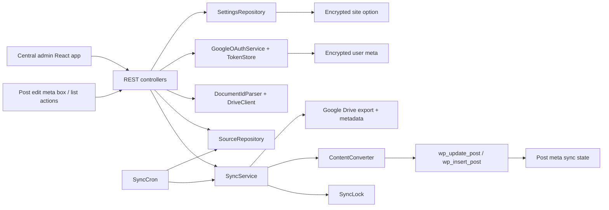

# System Architecture

Last updated: 2026-05-19

## Overview

DocSync WP is a WordPress plugin with two admin surfaces and one shared sync backend:

- central DocSync WP admin dashboard
- post edit meta box and list-table actions
- REST API and sync services shared by both surfaces

The implemented sync model is one-way Google Docs -> WordPress. Google Docs remains source of truth.

## Architecture Diagram

## Core Surfaces

### Central Admin Dashboard

- Entry point: `src/Admin/AdminPage.php`
- React mount: `resources/js/admin/main.tsx`
- Main UI: `resources/js/admin/App.tsx`

Responsibilities:

- configure Google OAuth and Picker settings
- guide self-managed Google Cloud setup with saved-state checks
- connect or disconnect the current WordPress user
- list linked sources across enabled post types
- trigger single-source sync and sync-all-changed actions
- show current connection mode and account readiness

### Post Edit Screen

- Entry point: `src/Admin/PostSyncMetaBox.php`
- React mount: `resources/js/admin/post-sync-entry.tsx`

Responsibilities:

- link a Google Doc to the current post, with Picker as default and pasted URL/file ID under advanced linking
- change or detach the source
- trigger immediate sync
- show last sync and error state

The Google Doc source modal uses Radix UI Dialog and Tabs primitives for focus management, escape handling, and keyboard tab navigation. The project still uses WordPress `wp-element` as the runtime React provider.

### Post List Table

- Entry point: `src/Admin/PostListActions.php`
- Same post-sync React bundle as the edit screen

Responsibilities:

- render `Add Sync Doc` button for enabled post types
- render inline `Link Google Doc` or `Sync Doc` row action
- render optional `DocSync` status column

## REST Layer

REST namespace: `docsync-wp/v1`

Implemented routes:

- `GET /settings`
- `POST /settings`
- `GET /oauth/google/url`
- `GET /oauth/google/account`
- `DELETE /oauth/google/account`
- `GET /oauth/google/callback`
- `POST /documents/inspect`
- `GET /sources`
- `POST /sources`
- `DELETE /sources/{postId}`
- `POST /sources/{postId}/sync`
- `POST /sources/sync-all`
- `GET /sync-log`

Common permission model:

- user must be logged in
- valid `X-WP-Nonce` or `_wpnonce`
- capability checks for the target post or post type
- enabled post type gate before source actions

## Data Model

### Site Options

- `docsync_wp_settings`
- stores Google connection mode, client id, encrypted client secret, Picker key/app id, enabled post types, default post status, default export format, and sync interval

### User Meta

- `_docsync_wp_google_token`
- stores encrypted access token, refresh token, expiry, scope, Google account email, and connection time

### Post Meta

- `_docsync_wp_google_file_id`
- `_docsync_wp_google_doc_url`
- `_docsync_wp_google_title`
- `_docsync_wp_google_modified_time`
- `_docsync_wp_google_version`
- `_docsync_wp_last_hash`
- `_docsync_wp_last_synced_at`
- `_docsync_wp_sync_owner_user_id`
- `_docsync_wp_export_format`
- `_docsync_wp_sync_status`
- `_docsync_wp_sync_error`

## Sync Flow

1. User connects Google from the admin dashboard.
2. User inspects a Doc through Picker by default, or through advanced pasted URL/raw file ID entry.
3. `DocumentController` validates the input and fetches Drive metadata.
4. `SourceController` attaches the source to an existing post or creates a new draft.
5. `SyncService` acquires a per-post lock.
6. `DriveClient` reads metadata and exports Markdown.
7. `ContentConverter` converts Markdown to sanitized HTML.
8. WordPress post content is updated.
9. Source state is saved back to post meta.
10. Result state becomes `linked`, `syncing`, `synced`, `skipped`, or `error`.

Skip behavior:

- if Google `modifiedTime`, `version`, and last hash show no change, sync is marked `skipped`
- lock prevents duplicate concurrent syncs for the same post

## Scheduling

- `src/Cron/SyncCron.php` registers `docsync_wp_sync_sources`
- schedule is controlled by the `sync_interval` setting
- supported intervals: `off`, `hourly`, `twicedaily`, `daily`
- cron job runs in small batches and syncs linked posts for the current source owner

## Security Model

- Google OAuth state is short-lived and tied to the current user
- Google tokens and client secret are encrypted with WordPress salt material
- REST requests require nonce verification
- post-level actions still require `edit_post` or post-type capability checks
- imported content is sanitized before write
- plugin never deletes synced posts on uninstall by default

## Operational Notes

- WP-Cron only runs on site traffic; low-traffic sites need real server cron for reliable schedules
- Google Picker is the preferred selection path for least-privilege access
- the current connection mode is `self_managed`; a later managed connector can own the verified Google app without proxying document content by default
- pasted Docs or raw file IDs only work when the connected Google account already has access
- Vite externalizes Radix React peer imports to `wp.element` and aliases Radix JSX runtime imports to the local WordPress JSX runtime shim; avoid direct app imports from `react` or `react-dom`
- Inline PHPCS suppression comments are blocked by the frontend lint guard; unavoidable standards exceptions must live in `phpcs.xml.dist`
- local verification in this checkout is blocked by missing `php` and `composer`
