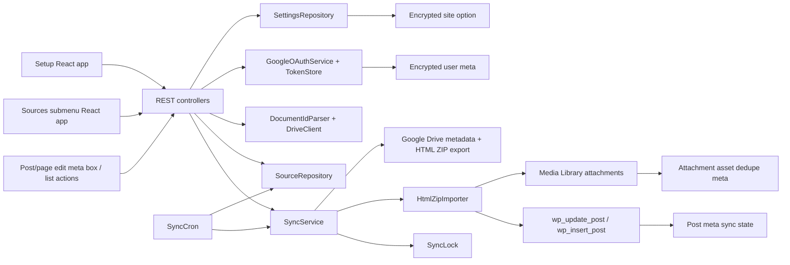

# System Architecture

Last updated: 2026-05-21

## Overview

DocSync WP is a WordPress plugin with three admin surfaces and one shared sync backend:

- `DocSync WP > Setup` for Google connection settings
- `DocSync WP > Sources` for linked source operations
- post/page edit meta boxes and list-table actions
- REST API and sync services shared by all surfaces

The implemented sync model is one-way Google Docs -> WordPress. Google Docs remains source of truth.

## Architecture Diagram

## Core Surfaces

### Setup Admin Page

- Entry point: `src/Admin/AdminPage.php`
- React mount: `resources/js/admin/entries/admin-entry.tsx`
- Main UI: `resources/js/admin/app/admin-app.tsx`

Responsibilities:

- configure Google OAuth settings
- guide self-managed Google Cloud setup with saved-state checks
- connect or disconnect the current WordPress user
- show current connection mode and account readiness

### Sources Admin Page

- Entry point: `src/Admin/AdminPage.php`
- Menu slug: `docsync-wp-sources`
- React mount: `resources/js/admin/entries/admin-entry.tsx`

Responsibilities:

- list linked sources across enabled WordPress targets
- filter by search, post type, and sync status
- paginate source results
- trigger single-source sync and global sync-all-changed actions

### Post/Page Edit Screen

- Entry point: `src/Admin/PostSyncMetaBox.php`
- React mount: `resources/js/admin/entries/post-sync-entry.tsx`

Responsibilities:

- link a Google Doc to the current target with the Drive-like My Drive/shared drive browser, with pasted URL/file ID under advanced linking
- change or detach the source
- trigger immediate sync
- show last sync and error state

The Google Doc source modal uses Radix UI Dialog and Tabs primitives for focus management, escape handling, and keyboard tab navigation. WordPress packages provide the runtime React provider, REST client, i18n, URL helpers, a11y announcements, and simple admin controls.

The post sync UI imports `resources/css/post-sync-entry.css`, which composes shared CSS primitives with modal, tab, Drive browser, advanced source, and post sync box partials.

## Frontend Architecture

- Vite builds two bundles from `resources/js/admin/entries/`.
- REST access is split under `resources/js/admin/api/`, with `apiFetch` imported from `@wordpress/api-fetch` and query strings built with `@wordpress/url`.
- Stateful workflows live in feature hooks, including Drive browser, source modal, setup/Sources admin, and post-sync actions.
- Shared UI atoms under `resources/js/admin/shared/ui/` wrap WordPress components where useful while preserving DocSync CSS classes.
- `resources/js/admin/components/` remains as thin compatibility exports during the refactor.

### Post/Page List Table

- Entry point: `src/Admin/PostListActions.php`
- Same post-sync React bundle as the edit screen

Responsibilities:

- render `Add Sync Doc` button for enabled post types
- render inline `Link Google Doc` or `Sync Doc` row action
- render optional `DocSync` status column

## REST Layer

REST namespace: `docsync-wp/v1`

Implemented routes:

- `GET /settings`
- `POST /settings`
- `GET /oauth/google/url`
- `GET /oauth/google/account`
- `DELETE /oauth/google/account`
- `GET /oauth/google/callback`
- `GET /drive/shared-drives` with `page_token` and `page_size` filters
- `GET /drive/items` with `folder_id`, `drive_id`, `search`, `page_token`, and `page_size` filters
- `GET /documents` with `search`, `page_token`, and `page_size` filters
- `POST /documents/inspect`
- `GET /sources` with `search`, `post_type`, `status`, `page`, and `per_page` filters
- `POST /sources`
- `DELETE /sources/{postId}`
- `POST /sources/{postId}/sync`
- `POST /sources/sync-all`
- `GET /sync-log`

Common permission model:

- user must be logged in
- valid `X-WP-Nonce` or `_wpnonce`
- capability checks for the target post or post type
- enabled post type gate before source actions

## Data Model

### Site Options

- `docsync_wp_settings`
- stores Google connection mode, client id, encrypted client secret, legacy Picker key/app id fields, enabled post types, default post status, default export format, and sync interval

### User Meta

- `_docsync_wp_google_token`
- stores encrypted access token, refresh token, expiry, scope, Google account email, and connection time

### Post Meta

- `_docsync_wp_google_file_id`
- `_docsync_wp_google_doc_url`
- `_docsync_wp_google_title`
- `_docsync_wp_google_modified_time`
- `_docsync_wp_google_version`
- `_docsync_wp_last_hash`
- `_docsync_wp_last_synced_at`
- `_docsync_wp_sync_owner_user_id`
- `_docsync_wp_export_format`
- `_docsync_wp_sync_status`
- `_docsync_wp_sync_error`

### Attachment Meta

- `_docsync_wp_google_asset_file_id`
- `_docsync_wp_google_asset_path`
- `_docsync_wp_google_asset_hash`

These identify images imported from a Google Docs HTML ZIP export so re-sync can reuse existing Media Library attachments.

## Sync Flow

1. User connects Google from the admin dashboard.
2. User browses My Drive or a selected shared drive and selects a Doc through the Drive browser, or inspects advanced pasted URL/raw file ID entry.
3. `DocumentController` lists Drive folders/Docs server-side and validates advanced input through Drive metadata.
4. `SourceController` attaches the source to an existing target or creates a new draft.
5. `SyncService` acquires a per-post lock.
6. `DriveClient` reads metadata and exports an HTML ZIP package.
7. `HtmlZipImporter` extracts the package, imports local images into Media Library, rewrites image URLs, and sanitizes HTML.
8. WordPress post content is updated only after export and import succeed.
9. Source state is saved back to post meta.
10. Result state becomes `linked`, `syncing`, `synced`, `skipped`, or `error`.

Skip behavior:

- if Google `modifiedTime`, `version`, and last hash show no change, sync is marked `skipped`
- lock prevents duplicate concurrent syncs for the same post
- legacy `markdown` export metadata is normalized to `html_zip` the next time source state is saved

## Scheduling

- `src/Cron/SyncCron.php` registers `docsync_wp_sync_sources`
- schedule is controlled by the `sync_interval` setting
- supported intervals: `off`, `hourly`, `twicedaily`, `daily`
- cron job runs in small batches and syncs linked posts for the current source owner

## Security Model

- Google OAuth state is short-lived and tied to the current user
- Google tokens and client secret are encrypted with WordPress salt material
- REST requests require nonce verification
- post-level actions still require `edit_post` or post-type capability checks
- imported content is sanitized before write
- local exported images are validated as image files before Media Library import
- image import failure marks sync `error` before target content is overwritten
- plugin never deletes synced posts on uninstall by default

## Operational Notes

- WP-Cron only runs on site traffic; low-traffic sites need real server cron for reliable schedules
- source selection uses `drive.readonly` and a server-side custom Drive document browser with per-drive shared drive queries
- setup and Sources screens import `resources/css/admin-entry.css`; the legacy `resources/css/admin.css` file remains as a compatibility wrapper
- the current connection mode is `self_managed`; a later managed connector can own the verified Google app without proxying document content by default
- pasted Docs or raw file IDs only work when the connected Google account already has access
- Vite externalizes Radix React peer imports and WordPress package imports to WordPress globals, and aliases Radix JSX runtime imports to the local WordPress JSX runtime shim; avoid direct app imports from `react` or `react-dom`
- Inline PHPCS suppression comments are blocked by the frontend lint guard; unavoidable standards exceptions must live in `phpcs.xml.dist`
- local verification in this checkout is blocked by missing `php` and `composer`
