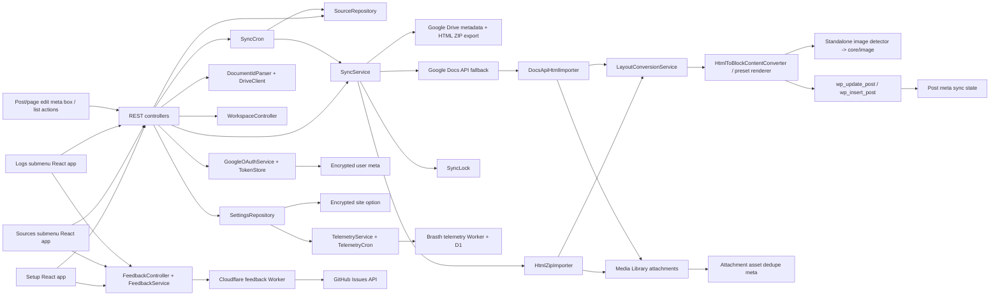
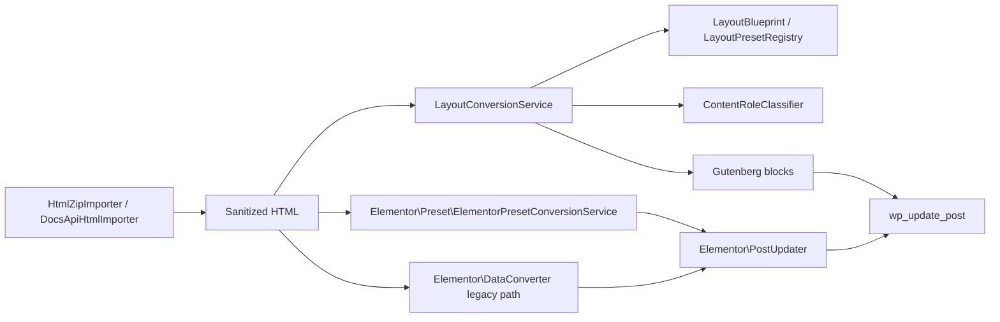

# System Architecture

Last updated: 2026-07-11

## Overview

Brasth Document Sync for Google Docs is a WordPress plugin with four admin surfaces and one shared sync backend:

- `Brasth Document Sync > Setup` for administrator-only site configuration and administrator activation
- `Brasth Document Sync > Sources` for capability-safe activation continuation and linked source operations
- `Brasth Document Sync > Logs` for bounded sync diagnostics
- shared admin feedback dialog for public GitHub issue submission
- post/page edit meta boxes and list-table actions
- REST API and sync services shared by all surfaces

The implemented sync model is one-way Google Docs -> WordPress. Google Docs remains source of truth.

## Architecture Diagram

## Core Surfaces

### Setup Admin Page

- Entry point: `src/Admin/AdminPage.php`
- React mount: `resources/js/admin/entries/setup-entry.tsx`
- Main UI: `resources/js/admin/app/setup-app.tsx`

Responsibilities:

- configure administrator-only site Google OAuth settings
- guide self-managed Google Cloud setup with saved-state checks
- connect or disconnect the current WordPress user
- distinguish site configuration, personal account readiness, and first-source activation
- open the shared Doc source modal directly, poll the first draft sync, and link to the completed draft
- clear site OAuth configuration, all local Google connections, and sync schedules through an explicit administrator-only action

### Sources Admin Page

- Entry point: `src/Admin/AdminPage.php`
- Menu slug: `brasth-document-sync-for-google-docs-sources`
- React mount: `resources/js/admin/entries/sources-entry.tsx`

Responsibilities:

- provide safe site/account/first-source guidance to users who can operate at least one enabled target type
- launch the shared Doc source modal directly for the first accessible source
- show accessible-source health counts and activation status
- list linked sources across enabled WordPress targets
- filter by search, post type, and sync status
- paginate source results
- trigger single-source sync and global sync-all-changed actions
- link directly to source-filtered diagnostic logs

### Logs Admin Page

- Entry point: `src/Admin/AdminPage.php`
- Menu slug: `brasth-document-sync-for-google-docs-logs`
- React mount: `resources/js/admin/entries/logs-entry.tsx`

Responsibilities:

- list bounded per-source sync diagnostic events newest first
- filter by linked source post ID and event level
- paginate event results
- show time, level, WordPress target, Google Doc title, status, step, progress, message, and error code without storing document content or Google responses

### Post/Page Edit Screen

- Entry point: `src/Admin/PostSyncMetaBox.php`
- React mount: `resources/js/admin/entries/post-sync-entry.tsx`

Responsibilities:

- link a Google Doc to the current target with the Drive-like My Drive/shared drive browser, with pasted URL/file ID under advanced linking
- choose WordPress Blocks or Elementor Layout when Elementor is available
- select the matching Gutenberg or Elementor layout preset
- change or detach the source
- trigger immediate sync
- upgrade legacy Elementor sources to Feature Block or Hero Page presets, or keep legacy conversion
- show active sync progress, terminal status, last sync, and error state
- prompt or reload the editor after background sync completes so stale editor content is not silently shown

The Google Doc source modal uses Radix UI Dialog and Tabs primitives for focus management, escape handling, and keyboard tab navigation. WordPress packages provide the runtime React provider, REST client, i18n, URL helpers, a11y announcements, and simple admin controls. The Drive browser panel is a lazy IIFE bundle loaded only when the modal browse mode opens.

The post sync UI imports `resources/css/post-sync-entry.css` for initial controls. Source modal CSS and Drive browser CSS are separate lazy assets exposed through `window.DocSyncWPAdmin`.

### Feedback Ticket Submission

The shared `AdminShell` renders a feedback dialog on Setup, Sources, and Logs. `POST /feedback` uses the normal REST nonce and `RestPermissions::canUseAuthenticatedRest()`, validates a bounded type/title/details payload, applies short-lived limits of five reports per user and twenty per IP per hour, and sends only non-sensitive WordPress/PHP/plugin version context to `FeedbackService`. The service relays to the Cloudflare Worker with `wp_remote_post()`; it never calls GitHub and never stores a GitHub credential.

The separate `cloudflare/feedback-worker/` deployment owns the GitHub fine-grained token as the `GITHUB_TOKEN` Wrangler secret, optionally checks `WORKER_SHARED_SECRET`, validates the request again, and creates an issue only in the configured `Brasth/DocSync-WP` repository. It returns only the issue number and URL, while hiding raw GitHub errors. Worker source is excluded from installable plugin ZIPs.

## Frontend Architecture

- Vite builds screen-specific Setup, Sources, Drive Folders, Logs, post-sync, source-modal-style, and Drive-browser entries from `resources/js/admin/entries/`.
- REST access is split under `resources/js/admin/api/`, including a normalized `workspace-api.ts` boundary; `apiFetch` comes from `@wordpress/api-fetch` and query strings use `@wordpress/url`.
- Stateful workflows live in feature hooks, including Drive browser, source modal, first-source activation, setup/Sources admin, and post-sync actions. `features/activation/activation-advisor.ts` is a pure mapper over server-authoritative workspace and current-account facts; it persists no wizard state.
- Shared UI atoms under `resources/js/admin/shared/ui/` wrap WordPress components where useful while preserving existing sync CSS classes.
- `resources/js/admin/components/` remains as thin compatibility exports during the refactor.

### Post/Page List Table

- Entry point: `src/Admin/PostListActions.php`
- Same post-sync React bundle as the edit screen

Responsibilities:

- render `Add Sync Doc` button for enabled post types
- render inline `Link Google Doc` or `Sync Doc` row action
- render optional sync status column
- queue new synced drafts in the background, poll source status, and refresh visible list-table content after sync finishes

## REST Layer

REST namespace: `brasth-document-sync-for-google-docs/v1`

Implemented routes:

- `GET /workspace`, returning `canManageSettings`, site connection readiness, capability-filtered available/enabled/creatable post types, safe publishing defaults/preset labels, Elementor availability, an accessible-source summary, and `cronHealth` (`lastRunAt`, `stalled`)
- `GET /settings`, including `defaultLayoutPreset`, `availableLayoutPresets`, `availableElementorLayoutPresets`, `telemetryEnabled`, and `telemetryPromptDismissed`
- `POST /settings`, including `defaultLayoutPreset`, optional `telemetryEnabled`, and optional `telemetryPromptDismissed`
- `DELETE /settings/oauth-configuration`, clearing the site OAuth client, all stored plugin Google tokens, and sync schedules while retaining sources and WordPress content
- `GET /oauth/google/url`
- `GET /oauth/google/account`
- `DELETE /oauth/google/account`
- `GET /oauth/google/callback`
- `GET /drive/shared-drives` with `page_token` and `page_size` filters
- `GET /drive/items` with `folder_id`, `drive_id`, `search`, `page_token`, and `page_size` filters
- `GET /drive/folders/{folderId}/documents` with `drive_id` and `include_subfolders` for a full folder inventory
- `GET/POST /folders`, `GET/PATCH/DELETE /folders/{id}`, and `POST /folders/{id}/scan|pause|resume|retry` for Drive folder watches
- `GET /documents` with `search`, `page_token`, and `page_size` filters
- `POST /documents/inspect`
- `GET /sources` with `search`, `post_type`, `status`, `page`, and `per_page` filters
- `POST /sources`, including optional `layoutPreset`, `elementorPreset`, `elementorSync`, and explicit `transferOwnership`
- `GET /sources/{postId}`
- `POST /sources/{postId}`, including optional `layoutPreset`, `elementorPreset`, and `elementorSync`
- `DELETE /sources/{postId}`
- `POST /sources/{postId}/sync`
- `POST /sources/sync-all`
- `GET /sync-log` with `search`, `post_id`, `level`, `status`, `step`, `page`, and `per_page` filters
- `DELETE /sync-log` with optional `post_id`, returning `{ cleared: number }`

`GET /workspace` is nonce-protected through `canUseAuthenticatedRest()` and uses an explicit safe-field allowlist. It contains no OAuth identifiers/secrets, tokens, Google account/email data, telemetry or schedule configuration, source/post/Google IDs, ownership identity, raw errors, messages, titles, or content. Its source summary includes only enabled targets passing normal per-post source authority, is capped at 500 accessible records, and reports `truncated` when the cap is reached.

Workspace source categories are exhaustive: `syncing` is active work; `healthy` is `synced` or `skipped` with a non-empty successful timestamp; every other accessible source is `attention`. `activated` becomes true only when at least one accessible source is healthy. Account connection alone is not activation.

Source records include additive live progress fields: `syncProgress` from 0 to 100, `syncStep`, and `syncMessage`. Existing status values and route shapes stay unchanged. Relinking an existing source owned by another operator requires `transferOwnership: true`; an unconfirmed request returns HTTP 409 with `docsync_wp_source_owner_transfer_required`.

Sync log entries are diagnostic events, not audit records. They store only `eventId`, timestamp, level, target/source titles, status, step, progress, message, error code, sync timestamps, and safe context flags such as lock state, cron-event state, and effective output path labels. Output-path context is limited to validated preset IDs and mode labels: Gutenberg preset, Elementor preset, or legacy Elementor converter.

Clearing sync logs deletes only `_docsync_wp_sync_events` for source posts the current user can edit. It does not delete source links, sync status, progress, credentials, or synced content.

Progress UI is shown only while a source is actively `syncing`; terminal states rely on status labels, last sync timestamps, and error messages.

Common permission model:

- user must be logged in
- valid `X-WP-Nonce` or `_wpnonce`
- Setup and all settings/site OAuth mutations require `manage_options`
- Sources, Logs, personal OAuth, Drive browsing, and workspace bootstrap require capability to edit or create at least one enabled target type
- capability checks for the target post or post type
- enabled post type gate before source actions

Menu visibility is only discoverability. Setup remains administrator-only; Sources and Logs render for capability-qualified operators. The top-level menu resolves to Sources for non-administrator operators and for administrators with a complete site connection plus at least one accessible source; otherwise it resolves to Setup. Direct Setup, Sources, and Logs URLs remain stable.

## Data Model

### Site Options

- `docsync_wp_settings`
- stores Google connection mode, client id, encrypted client secret, enabled post types, default post status, default export format, default layout preset, sync interval, telemetry opt-in state, and the private telemetry install identifier

### User Meta

- `_docsync_wp_google_token`
- stores encrypted access token, refresh token, expiry, scope, Google account email, and connection time

### Post Meta

- `_docsync_wp_google_file_id`
- `_docsync_wp_google_doc_url`
- `_docsync_wp_google_title`
- `_docsync_wp_google_modified_time`
- `_docsync_wp_google_version`
- `_docsync_wp_last_hash`
- `_docsync_wp_last_synced_at`
- `_docsync_wp_last_sync_method`
- `_docsync_wp_layout_preset`
- `_docsync_wp_elementor_preset`
- `_docsync_wp_last_layout_fingerprint`
- `_docsync_wp_sync_owner_user_id`
- `_docsync_wp_export_format`
- `_docsync_wp_sync_status`
- `_docsync_wp_sync_error`
- `_docsync_wp_sync_progress`
- `_docsync_wp_sync_step`
- `_docsync_wp_sync_message`
- `_docsync_wp_sync_started_at`
- `_docsync_wp_sync_updated_at`
- `_docsync_wp_sync_error_code`
- `_docsync_wp_sync_events`

### Attachment Meta

- `_docsync_wp_google_asset_file_id`
- `_docsync_wp_google_asset_path`
- `_docsync_wp_google_asset_hash`

These identify images imported from a Google Docs HTML ZIP export so re-sync can reuse existing Media Library attachments.

## Sync Flow

1. User connects Google from the admin dashboard.
2. User browses My Drive or a selected shared drive and selects a Doc through the Drive browser, or inspects advanced pasted URL/raw file ID entry.
3. `DocumentController` lists Drive folders/Docs server-side and validates advanced input through Drive metadata.
4. `SourceController` attaches the source to an existing target or creates a new draft.
   - Setup and Sources reuse this same modal/API path for first-source activation; no dedicated activation route or persisted wizard record exists.
   - Relinking does not silently replace `_docsync_wp_sync_owner_user_id`; a different operator must confirm transfer, after which scheduled sync responsibility moves to that operator's connection.
5. Admin manual syncs request background mode; inline REST mode remains available for compatibility.
6. Background mode stores source state as `syncing`, sets progress to `0` with step `queued`, schedules a single WP-Cron event, and returns a queued result.
7. `SyncService` acquires a per-post lock and updates milestone progress in source post meta while confirming the linked Google file has not changed.
8. `DriveClient` reads metadata, including `capabilities.canDownload`, `size`, and `quotaBytesUsed`; progress moves to `checking_google`.
9. If Drive reports `canDownload=false`, link/sync stops before content changes and error state preserves the last reached progress.
10. `DriveClient` exports an HTML ZIP package by default; progress moves to `exporting`.
11. If Google returns the 10 MB export-size failure, progress moves to `large_doc_fallback`, then `DocsApiHtmlImporter` reads the same document through `documents.get?includeTabsContent=true`, converts supported Docs structures to sanitized HTML, and imports inline image `contentUri` assets into Media Library.
12. `HtmlZipImporter` extracts the normal ZIP package, imports local images into Media Library, rewrites image URLs, and sanitizes HTML; progress moves through `importing`.
13. Gutenberg sync uses `LayoutConversionService` to resolve the effective Gutenberg layout preset from `_docsync_wp_layout_preset` or the site default, then either delegates `plain_blocks` to `HtmlToBlockContentConverter` or renders the selected preset; standalone image structures become native `core/image` blocks with supported captions and custom links. Elementor sync uses `ElementorPresetConversionService` when `_docsync_wp_elementor_preset` is set and otherwise keeps the legacy Elementor converter; progress moves to `converting`.
    - `Clean Article` demotes top-level document headings for post bodies and keeps code-looking Google Docs paragraphs as normal paragraphs.
    - `Documentation` uses `ContentRoleClassifier` plus `DocumentationCodeBlockDetector` to render semantic `pre`/`code`, fenced snippets, and code-like paragraph groups as `core/code`, while explicit `Note:`, `Tip:`, `Warning:`, `Important:`, and `Caution:` labels remain quote callouts.
    - `DocumentationCodeBlockDetector` is heuristic. It recognizes common shell, XML/JSON, Java/PHP/JavaScript-like, Gherkin, path, and file-tree shapes, but it is not a programming-language parser.
    - `Elementor Feature Block` groups headings, paragraphs, lists, images, tables, and dividers into clean Elementor sections with free widgets.
    - `Elementor Hero Page` promotes the first H1/H2, intro paragraph, and first image into a hero section, then renders remaining content as feature sections.
14. WordPress post content is updated only after export/import or fallback conversion and block conversion succeed; progress moves to `updating_post`.
15. Source state is saved back to post meta with `lastSyncMethod` set to `html_zip` or `docs_api_fallback` after successful content import.
16. Result state becomes `linked`, `syncing`, `synced`, `skipped`, or `error`; `synced` and `skipped` finish at `100`, while queued API responses use top-level `status: queued` and persisted state remains `syncing`.
17. First-source UI derives activation only from `synced`/`skipped` plus `lastSyncedAt`; success offers the real draft edit URL and Sources, while terminal errors preserve the created draft/source and expose a safe retry path.

Skip behavior:

- if Google `modifiedTime`, `version`, last hash, and the current layout fingerprint show no change, sync is marked `skipped`
- upgraded sources without a layout fingerprint are treated as current only when the effective preset is `plain_blocks`
- changing the default Gutenberg layout preset or explicit Elementor preset forces re-conversion even when Google metadata is unchanged; if converted content still hashes the same, the sync safely updates `_docsync_wp_last_layout_fingerprint` and finishes as `skipped`
- Elementor sources without `_docsync_wp_elementor_preset` keep the existing Elementor conversion and legacy skip behavior until the user selects an Elementor preset
- lock prevents duplicate concurrent syncs for the same post
- repeated manual sync requests keep active scheduled/running sync progress, refresh the sync lock during milestone saves, and can requeue a stale `syncing` source when no matching cron event or active lock remains
- source changes and detaches are blocked while a sync is running; stale background work stops if the linked Google file changes before a progress save or post update
- legacy `markdown` export metadata is normalized to `html_zip` the next time source state is saved
- large-doc fallback is automatic and only runs after the stable `docsync_wp_export_too_large` Drive export error

## Scheduling

- `src/Cron/SyncCron.php` registers `docsync_wp_sync_sources`
- background post-list sync also schedules `docsync_wp_sync_source` single events with `[postId, userId]`
- source sync-all scans a bounded, user-editability-aware set of due sources, queues one batch through the same single-source background hook, and asks WP-Cron to spawn once for that batch
- schedule is controlled by the `sync_interval` setting
- supported intervals: `off`, `hourly`, `twicedaily`, `daily`
- cron job runs in small batches and syncs linked posts for the current source owner
- manual queueing of an existing source also preserves the recorded sync owner; another editor's request does not silently change the scheduled Google identity
- recurring and single-source jobs do not schedule or run when the site OAuth configuration is incomplete
- the single-source handler calls `SyncService::syncPost()` so locking, imports, conversion, and error states stay centralized
- `src/Telemetry/TelemetryCron.php` registers `docsync_wp_telemetry_checkin` only when `telemetry_enabled` is true
- telemetry uses a weekly WP-Cron interval and unschedules itself when the site owner disables telemetry, deactivates, or uninstalls the plugin

## Optional Telemetry

Telemetry is opt-in and default off. Setup shows a compact inline consent panel until the site administrator opts in or dismisses it; the Sync defaults panel keeps the permanent `telemetryEnabled` checkbox. Both use the same settings route, and `telemetryPromptDismissed` stores only the local prompt state. `SettingsRepository` generates `telemetry_site_id` only after opt-in and clears it on opt-out; REST and admin config never expose the raw ID.

`TelemetryService` sends a weekly POST to `https://telemetry.brasth.com/v1/check-in`, filterable through `docsync_wp_telemetry_endpoint` for staging and tests. The payload contains `siteHash` as `sha256(telemetry_site_id)`, plugin slug, plugin version, WordPress version, PHP version, and consent version. It does not include Google data, site URL, user email, post data, Google document IDs, document metadata, document content, or imported media.

The isolated Cloudflare Worker lives under `cloudflare/telemetry-worker/`. It stores check-ins in D1 by `site_hash`, exposes `/health`, accepts `/v1/check-in`, protects `/v1/summary?window=30d` behind `Authorization: Bearer <ADMIN_TOKEN>`, and deletes rows older than 90 days from a daily scheduled Worker cron. The Worker intentionally does not store IP addresses, user agents, request URLs, or request headers.

## Security Model

- Google OAuth state is short-lived and tied to the current user
- Google tokens and client secret are encrypted with WordPress salt material
- REST requests require nonce verification
- post-level actions still require `edit_post` or post-type capability checks
- imported content is sanitized and normalized to block markup before write
- local exported images are validated as image files before Media Library import
- Docs API fallback image content URIs are downloaded to temporary files and validated before Media Library import
- image import failure marks sync `error` before target content is overwritten
- plugin never deletes synced posts on uninstall by default
- telemetry deactivation and uninstall clear `docsync_wp_telemetry_checkin`; full plugin uninstall also deletes the site option containing telemetry consent and private install ID

## Layout Preset Architecture

Version 1.1.0 added the Gutenberg **Layout Preset** layer. Version 1.1.2 adds a parallel Elementor preset layer without extending the Gutenberg blueprint model:

Current components:

- `src/Sync/Layout/LayoutBlueprint.php` — immutable preset metadata and behavior switches.
- `src/Sync/Layout/LayoutPresetRegistry.php` — built-in presets: `clean_article`, `documentation`, and `plain_blocks`.
- `src/Sync/Layout/ContentRoleClassifier.php` — role detection for headings, images, lists, tables, code blocks, callouts, and containers.
- `src/Sync/Layout/LayoutConversionService.php` — effective preset resolution, fingerprinting, and Gutenberg conversion.
- `src/Sync/Elementor/Preset/ElementorPresetBlueprint.php` — immutable Elementor preset metadata and behavior version.
- `src/Sync/Elementor/Preset/ElementorPresetRegistry.php` — built-in Elementor presets: `elementor_hero_page` and `elementor_feature_block`.
- `src/Sync/Elementor/Preset/ElementorPresetConversionService.php` — explicit Elementor preset fingerprinting and conversion to free Elementor widgets.
- `_docsync_wp_layout_preset` post meta — optional per-post override set from the link modal or post sync metabox; missing or empty means use the site default.
- `_docsync_wp_elementor_preset` post meta — optional per-post Elementor preset; missing or empty keeps the legacy Elementor converter for existing sources.
- `_docsync_wp_last_layout_fingerprint` post meta — prevents preset changes from being hidden by unchanged Google metadata.
- Setup sync defaults expose a compact `Default synced layout` dropdown through `GET/POST /settings`.
- Source linking and the post sync metabox switch the compact preset dropdown between Gutenberg presets and Elementor presets based on the active sync mode.
- `OutputTypeChoice` makes the WordPress Blocks vs Elementor Layout decision explicit before attach when Elementor is available.
- `LegacyElementorUpgradeNotice` gives existing legacy Elementor sources an in-place preset upgrade path without forcing migration.

Later phases add an in-linking preset gallery, preview endpoint, bulk Drive folder import, a custom preset builder, a Pro tier, a Google Docs Workspace Add-on, and optional managed OAuth. See `docs/project-roadmap.md` for the full phased plan.

## Operational Notes

- WP-Cron only runs on site traffic; low-traffic sites and sites with disabled WP-Cron need real server cron for reliable scheduled and manual background sync completion
- source selection uses `drive.readonly` and a server-side custom Drive document browser with per-drive shared drive queries
- self-managed Google Cloud setup must enable both Drive API and Docs API; no additional OAuth scope is required beyond `drive.readonly`
- the Drive browser loads pages of 50 results and uses an IntersectionObserver sentinel for infinite loading
- the post-list picker is fullscreen below the WordPress admin bar, closes after background queueing, and uses toast polling feedback instead of blocking the modal
- Setup, Sources, and Logs screens import screen-specific CSS; the legacy `resources/css/admin.css` file remains as a compatibility wrapper
- the current connection mode is `self_managed`; a later managed connector can own the verified Google app without proxying document content by default
- pasted Docs or raw file IDs only work when the connected Google account already has access
- Vite externalizes Radix React peer imports and WordPress package imports to WordPress globals, and aliases Radix JSX runtime imports to the local WordPress JSX runtime shim; avoid direct app imports from `react` or `react-dom`
- Inline PHPCS suppression comments are blocked by the frontend lint guard; unavoidable standards exceptions must live in `phpcs.xml.dist`
- local verification uses Composer, PHPCS, PHP syntax checks, fixture verifiers, pnpm lint/typecheck, and Vite builds
- `.devcontainer/` provides a disposable WordPress/MySQL runtime at `http://localhost:8890` with WP-CLI bootstrap and route verification scripts; `verify-runtime.sh` requires `/workspace` alongside the existing core routes
- the Cloudflare telemetry Worker is excluded from WordPress plugin ZIPs and has separate Node-based checks under `cloudflare/telemetry-worker/`
