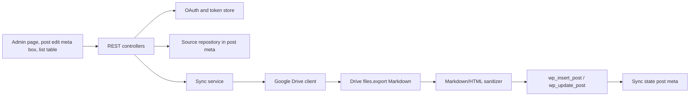

# Google Docs Sync Admin Actions

## Overview

Implement one-way Google Docs -> WordPress sync for default posts and custom post types. Users connect a Google account, choose a Google Doc through Picker or paste a Doc link/file id, map it to an existing post or new post, then sync from central DocSync admin, post edit screen, or post list table.

## Product Decisions

- MVP source of truth: Google Docs.
- OAuth client credentials: site-level settings. Google tokens: per WordPress user.
- Scope default: `https://www.googleapis.com/auth/drive.file` with Google Picker.
- Pasted link/id supported, but may require the file to already be app-accessible. If not, show "Choose with Google Picker" or enable broader Drive scope as a future setting.
- Export format: Markdown first. Zipped HTML/image import is later phase.
- Storage: site options + user meta + post meta. No custom table in MVP.
- Target post types: `post` plus enabled public CPTs that current user can edit.

## Admin UX

- DocSync top-level page: settings, connected account, sources, manual sync.
- Post edit/detail page: meta box with "Link Google Doc", "Change Doc", "Sync now", status, last sync.
- Post list page: top "Add Sync Doc" action for current post type.
- Post list row actions: "Link Google Doc" when unlinked, "Sync Doc" when linked.
- Source modal supports:
  - "Choose from Google" using Picker.
  - Paste Google Doc URL.
  - Paste raw Google Doc file id.

## Phases

| # | Phase | Status | Effort | Link |
|---|-------|--------|--------|------|
| 1 | Foundation and Data Model | Completed | 6h | [phase-01-foundation-data-model.md](./phase-01-foundation-data-model.md) |
| 2 | Google OAuth and Drive Client | Completed | 8h | [phase-02-google-oauth-drive-client.md](./phase-02-google-oauth-drive-client.md) |
| 3 | Sync Service and Import Pipeline | Completed | 8h | [phase-03-sync-service-import-pipeline.md](./phase-03-sync-service-import-pipeline.md) |
| 4 | Post Edit and List Table Entry Points | Completed | 8h | [phase-04-admin-post-entry-points.md](./phase-04-admin-post-entry-points.md) |
| 5 | Central Admin App, Scheduling, Logs | Completed | 6h | [phase-05-admin-app-scheduling-observability.md](./phase-05-admin-app-scheduling-observability.md) |
| 6 | Verification and Release Hardening | Blocked: PHP toolchain unavailable | 4h | [phase-06-verification-release-hardening.md](./phase-06-verification-release-hardening.md) |

## Architecture

## Dependencies

- Research: [docs/research/google-docs-wordpress-sync.md](../../docs/research/google-docs-wordpress-sync.md)
- Existing runtime: PHP 8.1+, WordPress 6.4+, Vite admin app.
- Add `wp-api-fetch` as an enqueued WordPress script dependency for REST calls.
- Google Picker requires Google Cloud API key/app id in addition to OAuth client id.

## Out of Scope

- Bidirectional sync.
- Block-perfect Google Docs to Gutenberg block conversion.
- Arbitrary Drive-wide browsing without Picker.
- Multi-site network management.
- Custom database sync log tables.

## Main Risks

- Pasted arbitrary Doc IDs conflict with least-privilege `drive.file`.
- Refresh token storage is sensitive.
- Imported content must be sanitized.
- Users can overwrite WordPress edits if conflict handling is vague.
- CPT capabilities differ; generic `manage_options` is too broad for post-level actions.

## Completion Criteria

- Admin can connect Google.
- Admin/editor can link a Google Doc from post edit screen.
- Admin/editor can create a new synced post from post list page.
- Linked rows expose inline "Sync Doc".
- Manual sync creates/updates WordPress content and sync metadata.
- REST endpoints enforce nonce and post-type/post capability checks.
- Verification commands pass: `composer validate`, `composer dump-autoload -o`, `vendor/bin/phpcs`, `pnpm typecheck`, `pnpm build`.

## Implementation Sync-Back

- 2026-05-18: Phases 4 and 5 implemented.
- 2026-05-18: `pnpm typecheck`, `pnpm lint`, and `pnpm build` passed.
- 2026-05-18: PHP validation blocked because `php`, `composer`, `vendor/`, and `vendor/bin/phpcs` are unavailable in this checkout.
- 2026-05-18: Source modal updated to Radix Dialog/Tabs primitives while keeping React runtime externalized to WordPress `wp.element`.
- 2026-05-18: Inline PHPCS suppression comments removed from plugin source; lint guard added and narrow ruleset exceptions documented in `phpcs.xml.dist`.
