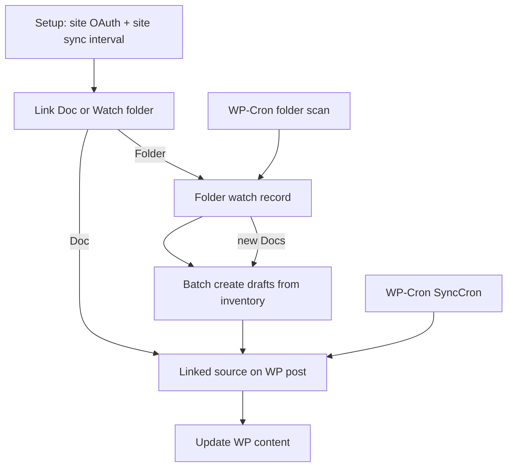

# Analysis: automation schedule sync for agents

Date: 2026-08-22

## Bottom line

Plugin already syncs Google Docs → WordPress on a site schedule and can watch Drive folders for new Docs. For agency **agents**, the automation is create-once and hard to operate. Need a setup UI per folder and per Doc.

## Current flow (simple)

## Gaps for agents

- Folder settings locked after create (no PATCH, confirm UI disabled)
- Sources folder strip = Scan/Pause/Resume/Remove only
- No per-Doc sync interval; all Docs share site cron
- Folder schedule (find new Docs) vs site schedule (refresh content) not explained in product UI
- No folder detail workspace listing child Docs + policy

## Proposal

See [plan.md](./plan.md). Short version:

1. Promote Folders into an agent Automations surface on Sources
2. Editable folder setup panel (schedule, draft/publish, layout, inventory)
3. Per-Doc setup inspector (layout + optional sync interval + parent folder)
4. Clear copy separating scan schedule vs content sync schedule

## Unresolved questions

- Sources tabs vs new Automations submenu?
- Folder-edit only first, or + per-Doc interval same release?
- Auto-publish free vs Pro later?
- Category/tag/author mapping in this track or later?
